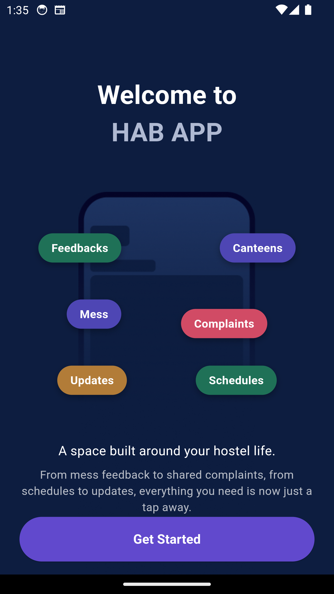
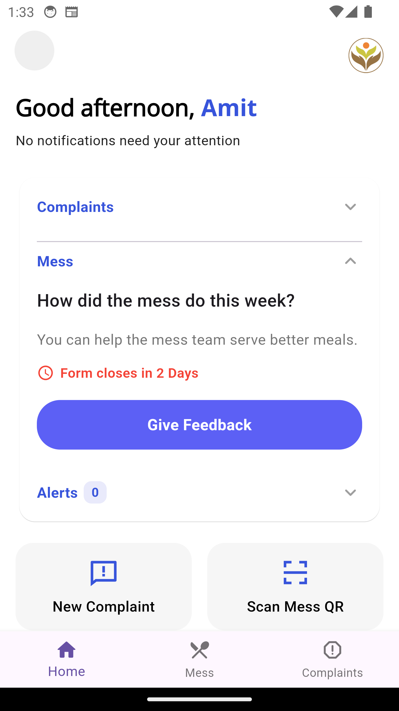
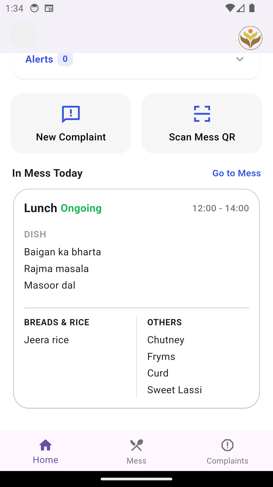
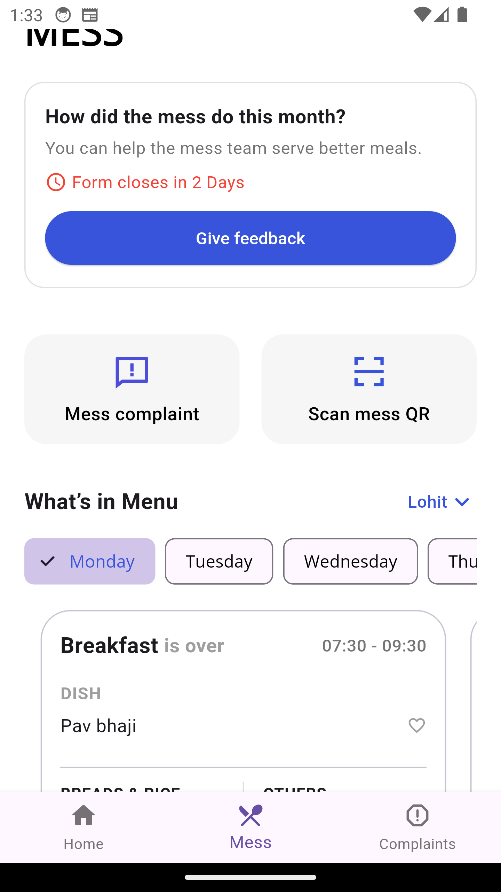
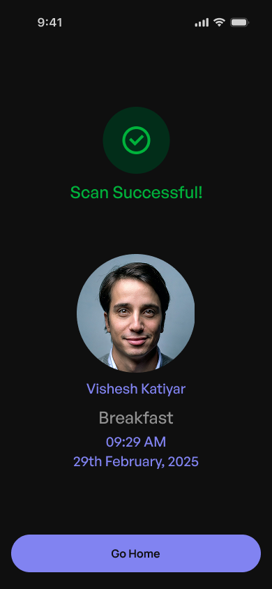
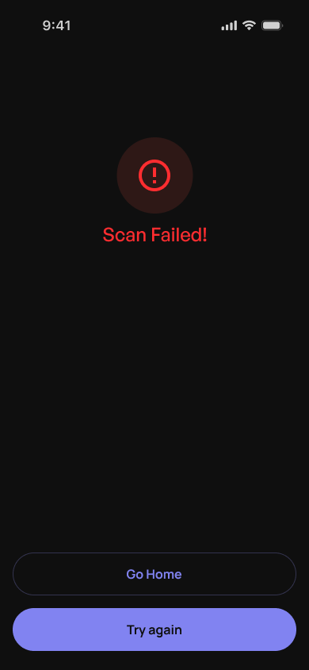
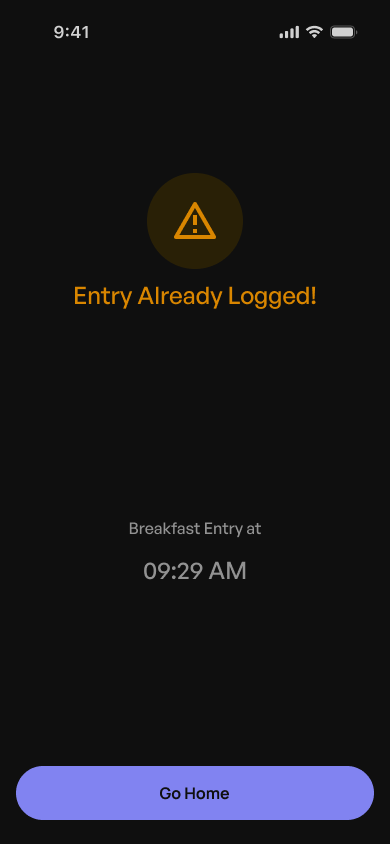

# 🏘️ Hostel Affairs Board

**Official IIT Guwahati Resident Portal**


An Official platform being made for IIT Guwahati residents to improve their living experience in campus.

This app helps students to put a complaint about issues faced in hostel. It also has a mess card system which enables swift authentication for mess related purposes.

---

## 📱 UI of the Application

> All UI mock-ups, prototypes, designs were created in Figma.

<div align="center">
  
  
  
  
  
  
  
  
</div>

## NOTE: JUST ONE PART OF THE APP OTHER PART IN PROGRESS

---

## ✨ Key Features

- **Complaint Management System**: Submit, track, and resolve hostel issues
- **Role-Based Access Control**:
  - Students: Submit/view complaints
  - Wardens: Approve/reject complaints
  - Admins: Manage system settings
- **QR Mess Cards**: Instant student verification for meal tracking
- **Secure Authentication**: JWT tokens with Outlook OAuth (Azure AD)
- **Modular REST API**: Structured Express.js backend with middleware support

---

## 🛠 Tech Stack

### Backend

- **Runtime**: Node.js 18
- **Framework**: Express.js
- **Database**: MongoDB Atlas
- **Authentication**: JWT + Azure Active Directory

### Frontend

- **Mobile App**: Flutter (iOS & Android)
- **Admin Panel**: React.js

### Infrastructure

- **Cloud**: AWS EC2 (Backend), S3 (Storage)
- **CI/CD**: GitHub Workflows

---

## ⚙️ Setup Guide

### Backend Setup

1. Clone the repository:
   ```bash
   git clone https://github.com/HABIITG/iitgHABapp.git
   cd server
   ```
2. Create .env file in the server directory with these variables:

   ```bash
   # MongoDB
   MONGODB_URI="your_mongodb_connection_string"

   # Azure AD, can be obtained from Azure portal
   CLIENT_ID="your_azure_app_id"
   CLIENT_SECRET="your_azure_secret"
   REDIRECT_URI="http://localhost:3000/auth/callback"

   # JWT
   JWT_SECRET="your_secure_random_string"

   # Outlook Email
   OUTLOOK_ID="sender@iitg.ac.in"
   OUTLOOK_PASS="email_password"
   NAME_ID="Hostel Affairs Board"

   # Server
   PORT=3000
   ```

3. Install dependencies and run:
   ```bash
   npm install
   npm run start
   ```

## 📜 License

IIT Guwahati © 2024 Hostel Affairs Board
